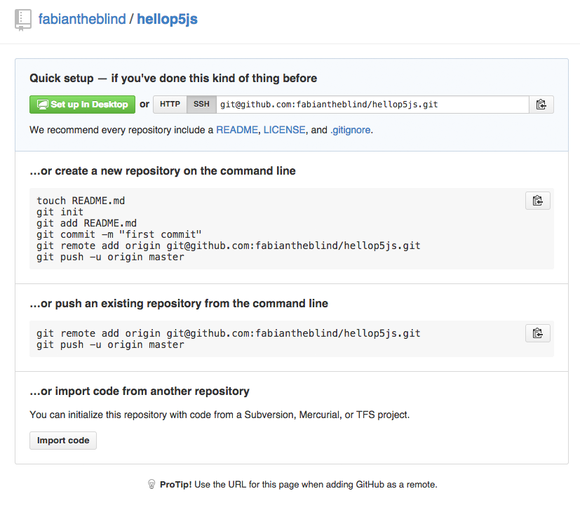
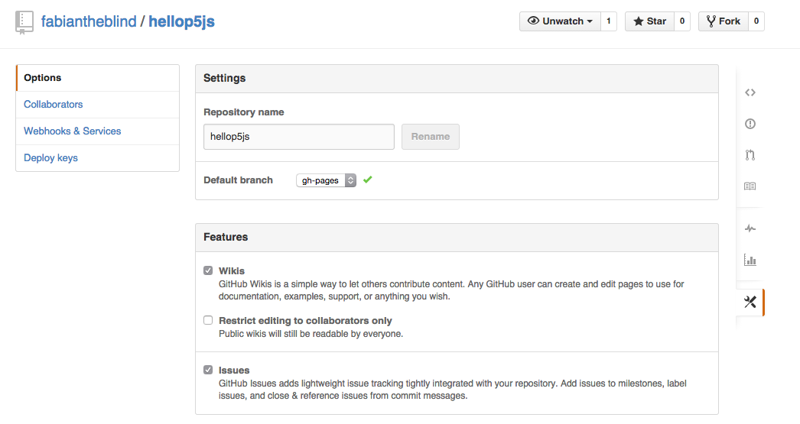

P5.js client/server side workshop
=================================

__Pre:__  
Processing is great. It can create so many things, is easy to use and crossplatform. But (there is always a but if somebody starts an introduction like this) getting sketches to the web is not that easy. Using the exported applets is not a good choice because the user will get an warning that there is Java running. Using Processing.js seemed always a bit buggy. Also it does not give you the full power of Javascript.  

#####P5.js enters the stage. Crowd goes wild.  

P5.js, written by Lauren McCarthy (@lmccart), is what we needed. A framework using most of the Processing syntax and all of its spirit. You can use all what Javascript has to offer you (like Processing did with Java).  

If you want to keep reading about P5.js go [over here](http://p5js.org/).  

__What this is not:__  

This is not a full Javascript, CSS & HTML tutorial. It is more the step by step guide to keep you up an running with client and server side Javascript. If you want to learn more JS, CSS or HTML, or even more, use recourses like:  

- [codecademy.com](http://www.codecademy.com/)  
- [javascriptissexy.com | How To Learn Javascript Properly](http://javascriptissexy.com/how-to-learn-javascript-properly/)  
- [codeschool.com](https://www.codeschool.com)
- and may more   

--------------------

##prerequisites  

You will need to get and install:  

- A server (I recommend [uberspace.de](https://uberspace.de/))  
- A text editor (I recommend [Sublime Text 3](http://www.sublimetext.com/3) or [Atom](https://atom.io/))  
- node.js (go get it. From the [binary download](http://nodejs.org/) or via [homebrew Mac](http://brew.sh/) `brew install node` or [Chocolatey Win](https://chocolatey.org/) `choco install nodejs.install`)
- install [bower](http://bower.io/) with node `npm install -g bower`
- install a simple [http server](https://github.com/nodeapps/http-server) with node `npm install -g http-server`
- and maybe [Grunt](http://gruntjs.com/) also with node `npm install -g grunt-cli`  
- A Terminal (Windows CMD or Mac Terminal.app)  

You need to learn some basics of the command line interface. We will do this step by step. If you want to speed up things a bit take a look at this great online book. [cli.learncodethehardway.org](http://cli.learncodethehardway.org/book/)  

##Getting Started with Client Side p5.js  

Open your Terminal and move to a good place like the Desktop.  

Mac:  

    cd ~/Desktop

Win:  

    cd c:\Users\(username)\Desktop  

Make a folder.  

    mkdir hellop5js  

Now cd into it.  

    cd hellop5js  

To setup your envoirment and install p5.js run:  

    bower init

and follow the instructions. It will look something like this:
    
    ? name: hellop5js
    ? version: 0.1.0
    ? description: something
    ? main file: index.html
    ? what types of modules does this package expose?:
    ? keywords:
    ? authors: fabiantheblind <icke@fabianmoronzirfas.me>
    ? license: MIT
    ? homepage:
    ? set currently installed components as dependencies?: Yes
    ? add commonly ignored files to ignore list?: Yes
    ? would you like to mark this package as private which prevents it from being accidentally published to the registry?: Yes
    
    {
      name: 'hellop5js',
      version: '0.1.0',
      authors: [
        'fabiantheblind <icke@fabianmoronzirfas.me>'
      ],
      description: 'somehing',
      main: 'index.html',
      license: 'MIT',
      private: true,
      ignore: [
        '**/.*',
        'node_modules',
        'bower_components',
        'test',
        'tests'
      ]
    }
    
    ? Looks good?: Yes

Then run:  

    bower install p5js --save
    bower install jquery --save

Actually we dont need jquery. This is just to show you how easy bower makes it to install all kinds of libraries.  

Great. We are nearly there. Now create a file with your favorite text editor with this content.  

    <!doctype html>
    <html lang="en">
    <head>
      <meta http-equiv="Content-Type" content="text/html; charset=utf-8">
      <title>a title</title>
      <meta name="description" content="something">
      <meta name="author" content="me">
      <link rel="stylesheet" type="text/css" href="styles.css">
      <!--[if lt IE 9]>
      
      <![endif]-->
    </head>
    <body>
        

        
        
        
    </body>
    </html>

Now create another file called styles.css next to it. We leave it empty for now. Just for information. This is your CSS file. You can add in things like this.  

    body{
      background-color: #90308d;
    }

Create your first p5.js sketch.  
Create a file called main.js next to the index.html and enter the following code into it.  

    function setup(){
      var the_canvas = createCanvas(640, 360);
      the_canvas.parent('thesketch');
    }
    
    function draw(){
    // draw some simple shapes
    // hint! The order in which you draw is important
    // change x and y to move him around
    var x = width/2;
    var y = 25;
    var w = 23; // make him bigger or smaller
    var h = w; // distort by changing the h seperatly
    var bmi = 1; // body mass index
    // a line takes 4 values the starting point and the end point
    line(x - w, y + h, x +w, y+h);
    // a ellipse always takes 4 values as parameter
    ellipse(x, y, w, h);
    // a point just two
    point(x, y); // look he has a nose
    // a rectangle also takes 4 values like the ellipse
    // but draws from its upper left corner
    rect(x-bmi/2, y + h, bmi, h);
    // you can also draw free forms by using vertecies
    noFill();
    beginShape();
    vertex(x - w, y + h*3);
    vertex(x - w, y + h*2);
    vertex(x + w, y + h*2);
    vertex(x + w, y + h*3);
    endShape();
    }

Does this look familiar? Yes it is nearly the same as in Processing. The only difference here is the `canvas` and the usage of the keyword `var` instead of `int` or `float`. If you want to read more about the differences take a look at [this article](https://github.com/lmccart/p5.js/wiki/Processing-transition).

Your file and folder structure should now look like this:

    .(hellop5js folder)
    ├── bower.json
    ├── bower_components
    │   ├── jquery (more files here)
    │   └── p5js (more files here)
    ├── index.html
    ├── main.js
    └── styles.css

Now go back to your terminal and enter

    http-server

and point your browser to this link [http://0.0.0.0:8080/](http://0.0.0.0:8080/).  
To stop the server just hit "CTRL + C".  
Awesome. You just created your first p5.js sketch with a basic setup for client side Javascript programming. If you want to make this available on the web there are several ways. I recommend these two.   
- Use your own uberspace.de server (simple way)  
- Use github (the nerdy cool terminal way)  

###Publish to Uberspace  

[Uberspace.de](https://uberspace.de/) is a german hoster. If you're outside of germany maybe you should choose something else. The documantation is german only. 

> Uberspace.de is a platform by technicians for technicians and all those who want to be one. We make hosting for command-line lovers, privacy advocates, controlkeepers, Unix friends, d-i-y-ers, somethingtosayers. And if it jams, you have experienced Linux admins at your site. 

You get 10GB of storage and the first month is free. If you decide to keep that uberspace you pay them by money transfer an amount of e.g 50€ and you can decide how high your price should be. It should be at least 1€, 5€ is cool if your website is on there. For that low price you get SSH. Perl. PHP. Python. Ruby. node.js. Erlang. Lua. Compiler. FastCGI. MySQL. CouchDB. MongoDB. Cronjobs. HTTPS. IMAP. SMTP. Webmail. qmail. vmailmgr. maildrop. Spam­Assassin. Own Logs. Backups. ... (full list [here](https://uberspace.de/tech)) 

Enoug with the advertisemnt. (Did I say that the servers are in germany, powered by green energy?).
To put all of this onto your uberspace.de server. Follow These steps:  

- create an [uberspace account](https://uberspace.de/register) and follow the instructions.   
- make sure you [add your email](https://uberspace.de/dashboard/mail) address to the uberspace
- make sure to add a [ssh password](https://uberspace.de/dashboard/authentication)  
- connect to the server with a file transfer client like Filezilla or Cyberduck or or or… 
- Make sure he is capable to use the SFTP protocol.
- login to your server via SFTP. You can get the server your onto from [this page](https://uberspace.de/dashboard/authentication) in our uberspace dashboard. It is the one under hostname.  
- Now upload all the files from the "hellop5js" folder into the folder html.  
- point your browser to your server. e.g. [http://fmz.pictor.uberspace.de/](http://fmz.pictor.uberspace.de/) (change the fmz to your username.)

If everything went fine and your index.html with all the assets is in the folder "html" you should see your processing sketch online. Congratulations.  

###Publish to Github Pages  

create a new repository on github called "hellop5js". Leave it empty. Don't create a .gitignore nor a README.md we will do this by ourselves.  
It should look something like this.  

  

Copy the clone url "git@github.com:fabiantheblind/hellop5js.git" to the clipboard. This url will of course contain your username not mine.  

go to your terminal and stop the server if it is still running.  
Now we are going to to do several things:  

- create a local git repo
- create a .gitignore
- create a README.md
- add the remote address
- move the js libraries we need to the root  
- add all out files to the version control
- create a branch for our github page  
- push to the server (master and gh-pages branch)  

Just follow these instructions step by step. (Not yet tested on windows)  
_Note: Most of the commands should work the same on windows and mac. To use git from the CMD see this [stackoverflow](http://stackoverflow.com/questions/11000869/command-line-git-on-windows) question_  

Enter into the Terminal:  

__!dont copy paste this type it by your self.__  
__!Exchange your username__  

    git init  
    echo "node_modules" >> .gitignore
    echo "bower_components" >> .gitignore  
    echo "Hello p5.js" >> README.md
    git remote add origin git@github.com:fabiantheblind/hellop5js.git
    cp bower_components/jquery/dist/jquery.min.js jquery.min.js
    cp bower_components/jquery/dist/jquery.min.map jquery.min.map
    cp bower_components/p5js/lib/p5.min.js p5.min.js

Now you need to change your index.html  
look for the lines:  

    
    

and change them to: 

    
    

Why? The `cp` command copies the libriaries to your root level but our index.html still points at the bower_components. But we excluded the bower_components. This is useful because we don't want all the files from the libraries added to our repo. But keep on.  

GO back to the terminal and enter the following lines.

    git add -A :/
    git commit -a -m "inital local commit"
    git branch gh-pages
    git push origin master
    git push origin gh-pages

This is it. Point your browser to http://[YOURUSERNAME].github.io/hellop5js/ (Again make sure to use your username.)

Awesome. You have your first project online.  

If you want to use this repo only for your micro website it is useful to set the gh-pages branch as the default. We will delete the master branch completely. Make sure you don't loose any data.  

Go to the settings of your repo. The URL is something like this. https://github.com/ [YOUR USER NAME] /hellop5js/settings and change the default branch to gh-pages.  

  

Back to the terminal in your project folder.  

Switch in to the gh-pages branch if your still in the master.

    git checkout gh-pages

To be sure you don't loose something from the master branch, merge it into the gh-pages branch

    git merge master

Now delete the master branch

    git branch -d master

and also delete it on the server

    git push origin :master

--------------

##Getting Started with Server Side Javascript  

Okay. Now what server side? Huh? To do things like rading and writing files you need to be an a server. When we ran the `http-server` command we actually started a webserver on our computer that speaks the http protocol. You can do this in serveral languages. We will explore the possibilites with node.js. Why because this is what the cool kids do nowadays.  

Make a folder for your project and cd into it.

    mkdir server-side
    cd server-side

To setup your project just type into your terminal:  

    npm init

This will walk you through a process similar to the bower process before. It will create a new file called package.json with all the infos you provided. When done type

    npm install p5 --save

This will create a folder called "node_modules", download the p5 library and add that info to your package.json.  

To make the routing of files easier we will use [servi.js](https://github.com/antiboredom/servi.js). So type:  

    npm install servi --save  

Make a new file called "index.js" and add the following code into it.  

    var servi = require('servi');
    var app = new servi(true);
    serveFiles("public");
    if(typeof run === 'function'){
      app.defaultRoute(run);
    }
    start();

Now create a new folder called "public" and some .html files into it. Create one called index.html and maybe some other files with names of your choice.   

Here is some Basic html you could add.  

<!doctype html>

    <html lang="en">
    <head>
      <meta http-equiv="Content-Type" content="text/html; charset=utf-8">
    
      <title>a title</title>
      <meta name="description" content="something">
      <meta name="author" content="me">
      <!--[if lt IE 9]>
      
      <![endif]-->
    </head>
    <body>
      <h1>Hello Stranger</h1>
    </body>
    </html>  

Now in the terminal run:  

    node index.js  

And point your browser to http://localhost:3000/ You will see the content of the index.html file. If you want to see the other files just change your URL to http://localhost:3000/other.html and the server will serve the file you are calling.  

Awesome you wrote your own server. You can serve html files with that and do some more complex things. For example you can use templates and databases.   

###Templates & Databases (tbd)

[wiki templates](https://github.com/antiboredom/servi.js/wiki#templates)  

###Servi and P5 (tbd)

###Bring it to a server with Forever (tbd)

###Sorces and Links  

####P5.js
- [P5.js](http://p5js.org/)  
- [p5.js overview | lmccart/p5.js Wiki](https://github.com/lmccart/p5.js/wiki/p5.js-overview)

####Servi.js

- [antiboredom/servi.js](https://github.com/antiboredom/servi.js)
- [Home | antiboredom/servi.js Wiki](https://github.com/antiboredom/servi.js/wiki)
- [Home | antiboredom/servi.js Wiki](https://github.com/antiboredom/servi.js/wiki#templates)
- [Web Servers with Servi | robynitp/networkedmedia Wiki](https://github.com/robynitp/networkedmedia/wiki/Web-Servers-with-Servi)
- Servi Docs installed with your node_module @ node_modules/servi/docs/classes/Servi.html

####Forever  

- [nodejitsu/forever](https://github.com/nodejitsu/forever)  
- [Keep Node.js script running after logging out from shell](http://www.hacksparrow.com/keep-node-js-script-running-after-logging-out-from-shell.html)

####Workshops & Tutorials 
- [lmccart/itp-creative-js](https://github.com/lmccart/itp-creative-js)
- [Learn Code the Hard Way | The CLI Crash Course](http://cli.learncodethehardway.org/)
- [p5.js workshop | EDP](https://github.com/shiffman/EDP-p5.js-workshop) (From here I got the whole idea of using Servi.js)

####Software & Server 
- [Hallo, wir sind Uberspace | Uberspace.de](https://uberspace.de/)
- [node.js](http://nodejs.org/)
- [Chocolatey Gallery | Package Manager WIN](https://chocolatey.org)  
- [Homebrew | The missing package manager for OS X](http://brew.sh/)
- [Bower | A package manager for the web](http://bower.io/)
- [Grunt | The JavaScript Task Runner](http://gruntjs.com)
- [nodeapps/http-server](https://github.com/nodeapps/http-server)
- [Sublime Text 3](http://www.sublimetext.com/3)
- [sftp client | Google Search](https://encrypted.google.com/search?hl=en&q=sftp%20client)

####Examples
- [fabiantheblind/hellop5js | repo to this Workshop](https://github.com/fabiantheblind/hellop5js)
- [Simple Particle System | P5.js](http://fabiantheblind.github.io/simple_particle_system_p5js/)

####Questions That came up  
- [Command-line Git on Windows | Stack Overflow](http://stackoverflow.com/questions/11000869/command-line-git-on-windows)
- [What is the MS-DOS path for the Windows Desktop?](http://www.computerhope.com/issues/ch000928.htm)
- [Generating SSH keys | User Documentation](https://help.github.com/articles/generating-ssh-keys/#platform-mac)

##License

Copyright (c)  2014 FH-Potsdam & Fabian "fabiantheblind" Morón Zirfas  
Permission is hereby granted, free of charge, to any person obtaining a copy of this software and associated documentation files (the "Software"), to deal in the Software  without restriction, including without limitation the rights to use, copy, modify, merge, publish, distribute, sublicense, and/or sell copies of the Software, and to  permit persons to whom the Software is furnished to do so, subject to the following conditions:  
The above copyright notice and this permission notice shall be included in all copies or substantial portions of the Software.  
THE SOFTWARE IS PROVIDED "AS IS", WITHOUT WARRANTY OF ANY KIND, EXPRESS OR IMPLIED, INCLUDING BUT NOT LIMITED TO THE WARRANTIES OF MERCHANTABILITY, FITNESS FOR A  PARTICULAR PURPOSE AND NONINFRINGEMENT. IN NO EVENT SHALL THE AUTHORS OR COPYRIGHT HOLDERS BE LIABLE FOR ANY CLAIM, DAMAGES OR OTHER LIABILITY, WHETHER IN AN ACTION OF  CONTRACT, TORT OR OTHERWISE, ARISING FROM, OUT OF OR IN CONNECTION WITH THE SOFTWARE OR THE USE OR OTHER DEALINGS IN THE SOFTWARE.  

see also http://www.opensource.org/licenses/mit-license.php

